# CDR MONITORING APP (SERVERLESS) AWS ECS FARGATE


In this project, I utilized the infrastructure setup provided in the [aws-samples repository](https://github.com/aws-samples/amazon-ecs-fullstack-app-terraform) as a foundation. This repository contains a Terraform configuration for deploying a full-stack application on Amazon ECS, which I adapted to meet the specific requirements of my project. Again, as part of my journey in learning DevOps and coding, I plan to build a similar project on-premises and then transition it to a serverless architecture, this time using **AWS ECS**.


## ON Premise project app.

**Architecture** 

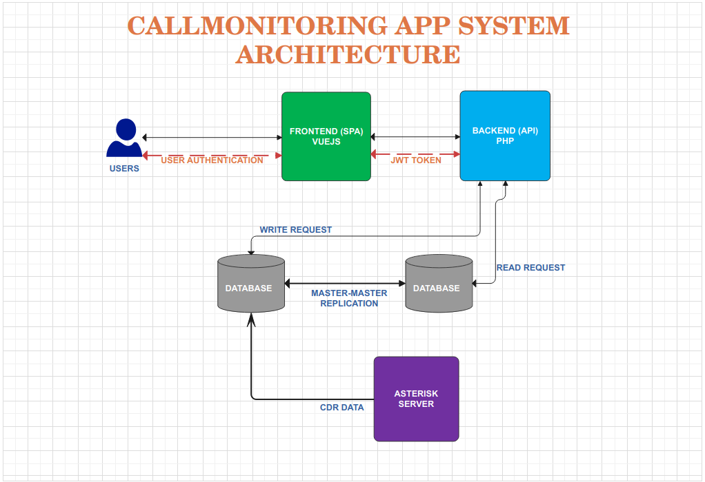

**Technologies Used**
- Frontend --> VUEJS Framework.
- Backend/API  --> PHP 
- Authentication --> JWT TOKEN
- Database --> Mysql


## AWS Serveless Project App (AWS-ECS FARGATE)


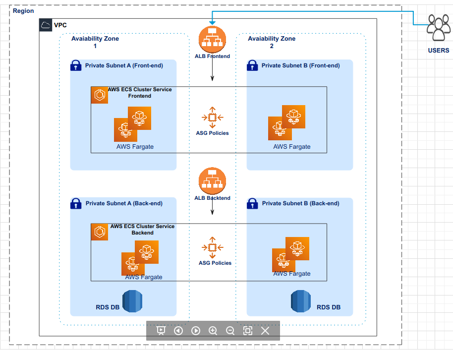

**Technologies Used**
- Frontend --> AWS ECS FARGATE
- Backend --> AWS ECS FARGATE 
- Database --> RDS Mysql
- Authentication -->  JWT TOKEN
- Infrastructure As Code - Terraform

## Pipeline Arch. 


**I made only minimal adjustments to the Terraform infrastructure from this project to suit my needs. I tweaked a few settings, removed resources that were unnecessary for my project, and added the ones I required**

Resource Remove:
 - **Dynamodb** -> Because my project is using MySQL Database I replace it with RDS Instance 

Resource Added and Update:
- **RDS Database**
- **Security Group** -  I split **SecurityGroup Modules**, one is with Mysql Rule and one without.
- **CodeBuild** - Added more environment variables 
- **buildspec.yaml** - also change base on my project requirements
- **Code** - My frontend and backend code. Dockerfiles are updated as well.


## Project Implementation and Walkthrough

## SECTION 1 - Project Setup.
1. Clone the aws-samples [amazon-ecs-fullstack-app-terraform](https://github.com/aws-samples/amazon-ecs-fullstack-app-terraform.git) 

```bash
   git clone https://github.com/aws-samples/amazon-ecs-fullstack-app-terraform.git
```

2. Create a new repository on GitHub (**you can choose the name**). Change the remote URL to your new repository and push the project to your new repository:

```bash
   cd amazon-ecs-fullstack-app-terraform
   git remote set-url origin <your-repo-url> 
   git push -u origin main
```

3. Update **aws-ecs-fullstack-app-terraform/Infrastructure/Templates/buildspec.yaml** as follows:

```yaml
# Copyright Amazon.com, Inc. or its affiliates. All Rights Reserved.
# SPDX-License-Identifier: MIT-0

version: 0.2

phases:
  pre_build:
    commands:
      - echo Checking for build type
      - echo "Logging in to Docker Hub..."
      - echo "docker username is $DOCKER_HUB_USERNAME"
      - echo "docker password is $DOCKER_HUB_PASSWORD"
      - echo $DOCKER_HUB_PASSWORD | docker login --username $DOCKER_HUB_USERNAME --password-stdin
      - |
        if expr "${FOLDER_PATH}" : ".*client*" ; then
          echo "Client build, embedding frontend layer file with ALB backend DNS"
          export VUE_APP_API_ENDPOINT="$SERVER_ALB_URL"
          echo "CREATE .env file in client folder"
          touch  $FOLDER_PATH/.env
          echo "VUE_APP_API_ENDPOINT=http://$SERVER_ALB_URL" >> $FOLDER_PATH/.env
        else
          echo "Server build, adding ECS Task Role to the task definition file"
          sed -i "3i\"taskRoleArn\": \"arn:aws:iam::$AWS_ACCOUNT_ID:role/$ECS_TASK_ROLE\"," ./Infrastructure/Templates/taskdef.json
          echo "CREATE .env file in server folder"
          echo $DB_HOST
          echo $DB_USER
          echo $DB_NAME
          touch  $FOLDER_PATH/app/.env
          echo "DB_HOST=$DB_HOST" >>  $FOLDER_PATH/app/.env
          echo "DB_NAME=$DB_NAME" >>  $FOLDER_PATH/app/.env
          echo "DB_PASSWORD=$DB_PASSWORD" >>  $FOLDER_PATH/app/.env
          echo "DB_USER=$DB_USER" >>  $FOLDER_PATH/app/.env
          echo "SECRET_KEY=$SECRET_KEY" >>  $FOLDER_PATH/app/.env
          echo "ALGORITHM=$ALGORITHM" >>  $FOLDER_PATH/app/.env
          echo "ACCESS_TOKEN_EXPIRE_MINUTES=$ACCESS_TOKEN_EXPIRE_MINUTES" >>  $FOLDER_PATH/app/.env
        fi
  build:
    commands:
      - echo Build started on `date`
      - echo Building the Docker image...
      - docker build -t $REPO_URL $FOLDER_PATH
      - docker logout
      # - docker build -t robudex17/cm_api $FOLDER_PATH
   
  post_build:
    commands:
      - echo Logging in to Amazon ECR...
      - aws ecr get-login-password --region $AWS_REGION | docker login --username AWS --password-stdin $AWS_ACCOUNT_ID.dkr.ecr.$AWS_REGION.amazonaws.com
      - echo Build completed on `date`
      - echo Pushing the Docker image...
      - docker push $REPO_URL:$IMAGE_TAG
      # - docker push robudex17/cm_api
      - echo Changing directory to Templates directory
      - cd ./Infrastructure/Templates
      - echo Preparing spec files in new folder
      - mkdir Artifacts
      - cp appspec.yaml Artifacts/appspec.yaml && cp taskdef.json Artifacts/taskdef.json
      - echo Changing directory to the Artifacts directory
      - cd Artifacts
      - echo Preparing artifacts
      - sed -i "s|<TASK_DEFINITION_FAMILY>|$TASK_DEFINITION_FAMILY|g" taskdef.json
      - sed -i "s|<CONTAINER_NAME>|$CONTAINER_NAME|g" appspec.yaml taskdef.json
      - sed -i "s|<SERVICE_PORT>|$SERVICE_PORT|g" appspec.yaml taskdef.json
      - sed -i "s|<ECS_ROLE>|$ECS_ROLE|g" taskdef.json
      - sed -i "s|<ECS_TASK_ROLE>|$ECS_TASK_ROLE|g" taskdef.json
      - sed -i "s|<REPO_URL>|$REPO_URL|g" taskdef.json
      - sed -i "s|<AWS_ACCOUNT_ID>|$AWS_ACCOUNT_ID|g" taskdef.json
      - sed -i "s|<AWS_REGION>|$AWS_REGION|g" taskdef.json

artifacts:
  files:
    - '**/*'
  base-directory: 'Infrastructure/Templates/Artifacts'
  discard-paths: yes

```

4.Split the Security Group into two modules:

- aws-ecs-fullstack-app-terraform/Infrastructure/Modules/SecurityGroup/SecurityGroupWithMysql => Includes MySQL Inbound Rules.
- aws-ecs-fullstack-app-terraform/Infrastructure/Modules/SecurityGroup/SecurityGroupWithMysql => No Inbound Rules Included.


5.Add variables to **aws-ecs-fullstack-app-terraform/Infrastructure/Modules/CodeBuild/variables.tf** and comment out the DynamoDB variable.

```bash 

variable "db_host" {
  description = "RDS Enpoint"
  type = string 
  default     = ""
 }

 variable "db_user" {
  description = "RDS username"
  type = string 
  default     = ""
 }


variable "db_password" {
  description = "RDS password"
  type = string
  default     = ""
}

variable "db_name" {
  description = "RDS database"
  type = string
  default     = ""

}

variable "secret_key" {
  description = "JWT Token Secret Key"
  type = string
  default     = ""

}


variable "algorithm" {
  description = "JWT Used algorithm"
  type = string
  default     = ""
}

variable "access_token_expire_minutes" {
  type = number
  default = 0
}

variable "docker_hub_username" {
  type = string
  default = ""
}

variable "docker_hub_password" {
  type = string
  default = ""
}
```

6. Add these environment variables in **aws-ecs-fullstack-app-terraform/Infrastructure/Modules/CodeBuild/main.tf** as well, and comment out the DynamoDB environment variable.


```bash
    environment_variable {
      name  = "DB_HOST"
      value = var.db_host
    }

    environment_variable {
      name  = "DB_USER"
      value = var.db_user
    }

    environment_variable {
      name  = "DB_PASSWORD"
      value = var.db_password
    }


    environment_variable {
      name  = "DB_NAME"
      value = var.db_name
    }

    environment_variable {
      name  = "ALGORITHM"
      value = var.algorithm
    }

    environment_variable {
      name  = "ACCESS_TOKEN_EXPIRE_MINUTES"
      value = var.access_token_expire_minutes
    }

    environment_variable {
      name = "DOCKER_HUB_USERNAME"
      value = var.docker_hub_username
    }

    environment_variable {
      name = "DOCKER_HUB_PASSWORD"
      value = var.docker_hub_password
    }
       
```

7. On **aws-ecs-fullstack-app-terraform/Code**, I delete client and backend folders. And replace it with my project code.


8. In the **aws-ecs-fullstack-app-terraform/Infrastructure/main.tf** file, comment out any DynamoDB-related resources and settings, and update some settings.

- module "security_group_alb_server" 
```bash
  module "security_group_alb_server" {
  source              = "./Modules/SecurityGroup/SecurityGroupWithoutMysql"
  name                = "alb-${var.environment_name}-server"
  description         = "Controls access to the server ALB"
  vpc_id              = module.networking.aws_vpc
  cidr_blocks_ingress = ["0.0.0.0/0"]
  ingress_port        = 80

}
```
- module "security_group_alb_client"

```bash
  module "security_group_alb_client" {
  source              = "./Modules/SecurityGroup/SecurityGroupWithoutMysql"
  name                = "alb-${var.environment_name}-client"
  description         = "Controls access to the client ALB"
  vpc_id              = module.networking.aws_vpc
  cidr_blocks_ingress = ["0.0.0.0/0"]
  ingress_port        = 80
}
```
- module "security_group_ecs_task_server"
```bash
  module "security_group_ecs_task_server" {
  source          = "./Modules/SecurityGroup/SecurityGroupWithMysql"
  name            = "ecs-task-${var.environment_name}-server"
  description     = "Controls access to the server ECS task"
  vpc_id          = module.networking.aws_vpc
  ingress_port    = var.port_app_server
  security_groups = [module.security_group_alb_server.sg_id]


}
```

- module "security_group_ecs_task_client"
```bash
  module "security_group_ecs_task_client" {
  source          = "./Modules/SecurityGroup/SecurityGroupWithoutMysql"
  name            = "ecs-task-${var.environment_name}-client"
  description     = "Controls access to the client ECS task"
  vpc_id          = module.networking.aws_vpc
  ingress_port    = var.port_app_client
  security_groups = [module.security_group_alb_client.sg_id]

}
```

- module "codebuild_server" 

```bash
module "codebuild_server" {
  source                 = "./Modules/CodeBuild"
  name                   = "codebuild-${var.environment_name}-server"
  iam_role               = module.devops_role.arn_role
  region                 = var.aws_region
  account_id             = data.aws_caller_identity.id_current_account.account_id
  ecr_repo_url           = module.ecr_server.ecr_repository_url
  folder_path            = var.folder_path_server
  buildspec_path         = var.buildspec_path
  task_definition_family = module.ecs_taks_definition_server.task_definition_family
  container_name         = var.container_name["server"]
  service_port           = var.port_app_server
  ecs_role               = var.iam_role_name["ecs"]
  ecs_task_role          = var.iam_role_name["ecs_task_role"]
  db_host                     = var.db_host
  db_user                     = var.db_user
  db_password                 = var.db_password
  db_name                     = var.db_name
  secret_key                  = var.secret_key
  algorithm                   = var.algorithm
  access_token_expire_minutes = var.access_token_expire_minutes
  docker_hub_username         = var.docker_hub_username
  docker_hub_password         = var.docker_hub_password
}
```
- module "codebuild_client" 
```bash
   module "codebuild_client" {
  source                      = "./Modules/CodeBuild"
  name                        = "codebuild-${var.environment_name}-client"
  iam_role                    = module.devops_role.arn_role
  region                      = var.aws_region
  account_id                  = data.aws_caller_identity.id_current_account.account_id
  ecr_repo_url                = module.ecr_client.ecr_repository_url
  folder_path                 = var.folder_path_client
  buildspec_path              = var.buildspec_path
  task_definition_family      = module.ecs_taks_definition_client.task_definition_family
  container_name              = var.container_name["client"]
  service_port                = var.port_app_client
  ecs_role                    = var.iam_role_name["ecs"]
  server_alb_url              = module.alb_server.dns_alb
  db_host                     = var.db_host
  db_user                     = var.db_user
  db_password                 = var.db_password
  db_name                     = var.db_name
  secret_key                  = var.secret_key
  algorithm                   = var.algorithm
  access_token_expire_minutes = var.access_token_expire_minutes
  docker_hub_username         = var.docker_hub_username
  docker_hub_password         = var.docker_hub_password
}
```

9. In the **aws-ecs-fullstack-app-terraform/Infrastructure/variables.tf** file, I added the necessary variables to meet the requirements of my project and set the default values for **port_app_server** and **port_app_client** to port **80**.

```bash
variable "db_host" {
  description = "RDS Enpoint"
  type        = string
}

variable "db_user" {
  description = "RDS username"
  type        = string
}


variable "db_password" {
  description = "RDS password"
  type        = string
}

variable "db_name" {
  description = "RDS database"
  type        = string

}

variable "secret_key" {
  description = "JWT Token Secret Key"
  type        = string

}


variable "algorithm" {
  description = "JWT Used algorithm"
  type        = string
}

variable "access_token_expire_minutes" {
  type    = number
  default = 0
}

variable "docker_hub_username" {
  type    = string
  default = ""
}

variable "docker_hub_password" {
  type    = string
  default = ""
}
```
10. Create a **terraform.tfvars** file in the **aws-ecs-fullstack-app-terraform/Infrastructure** directory and add the required variables.

```bash
aws_profile                 = <REPLACE IT WITH YOUR AWS PROFILE> #make sure that this profile as enough credentials do this project..For simplicity, Make your    credentials as Administrator  
aws_region                  = <REPLACE IT WITH YOUR AWS REGION>
environment_name            = "development"
github_token                = <REPLACE IT WITH YOUR GITHUB TOKEN>
repository_name             = <REPLACE IT WITH YOUR GITHUB REPO NAME>
repository_owner            = <REPLACE IT WITH YOUR GITHUB REPO OWNER>
secret_key                  = <REPLACE IT WITH YOUR SECRET KEY>
algorithm                   = "HS256"
access_token_expire_minutes = 60
docker_hub_username         = <REPLACE IT WITH YOUR DOCKERHUB USERNAME>
docker_hub_password         = <REPLACE IT WITH YOUR DOCKERHUB PASSWORD>

db_host     = "localhost"
db_user     = "user01"
db_password = "password"
db_name     = "dbtest"

``` 
**_Important Note: The values you input in terraform.tfvars must not be shared publicly as they contain sensitive information. Ensure that you add this file to your .gitignore to prevent it from being tracked in version control._**

11. Now that everything is set, it's time to build the infrastructure for our project using Terraform. But first, let's commit our changes to the repository.

```bash
   git add .
   git commit -m "update settings"
   git push
```


## Section 2 - Building The Infrustuctures

The Command that we use in this section are:
- terraform init: Initializes Terraform in the working directory.
- terraform validate: Checks the configuration for syntax errors.
- terraform fmt: Formats Terraform files to standard style.
- terraform plan: Previews the changes Terraform will make.
- terraform apply: Executes the changes to infrastructure.

1. cd to /aws-ecs-fullstack-app-terraform/Infrastructure and run the Terraform commands.

```bash
   cd /aws-ecs-fullstack-app-terraform/Infrastructure
   terraform init
   terraform validate 
   terraform fmt
   terraform plan
   terraform apply
```

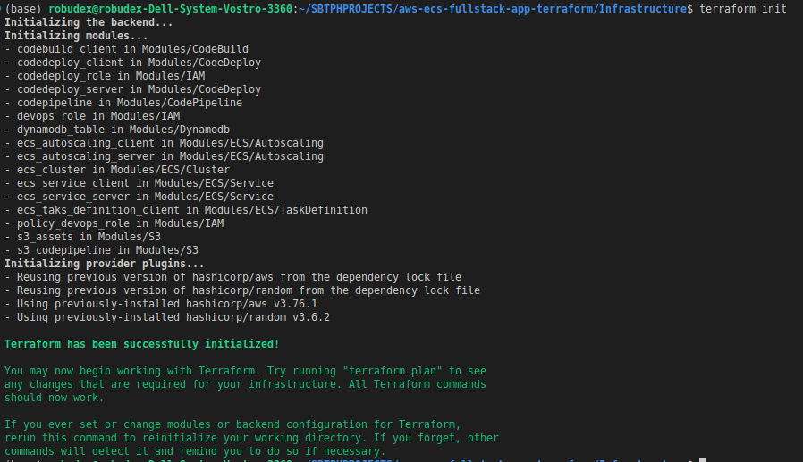


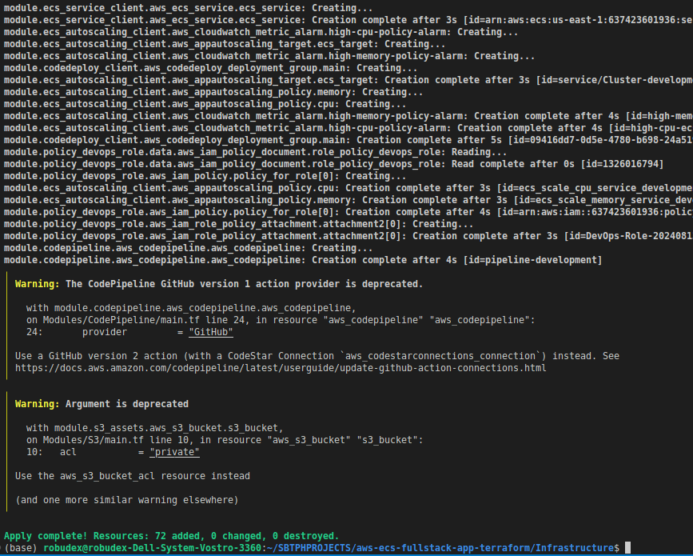

2.When Terraform is done, double-check the AWS console to ensure the resources have indeed been created.

**VPC:**

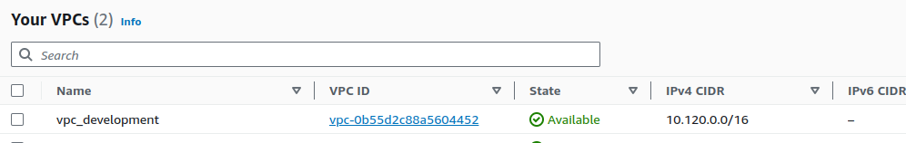


**SecurityGroup:**

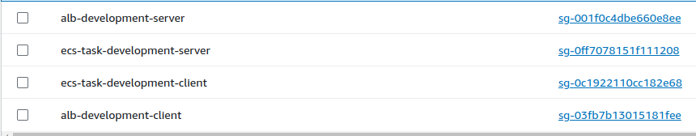


**NatGateway:**

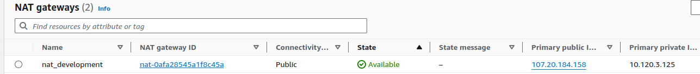


**Application LoadBalancer**

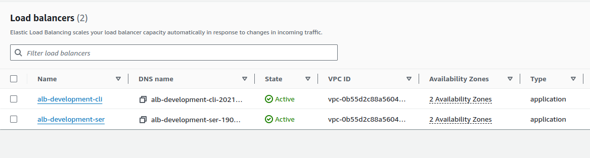

**TargetGroup**


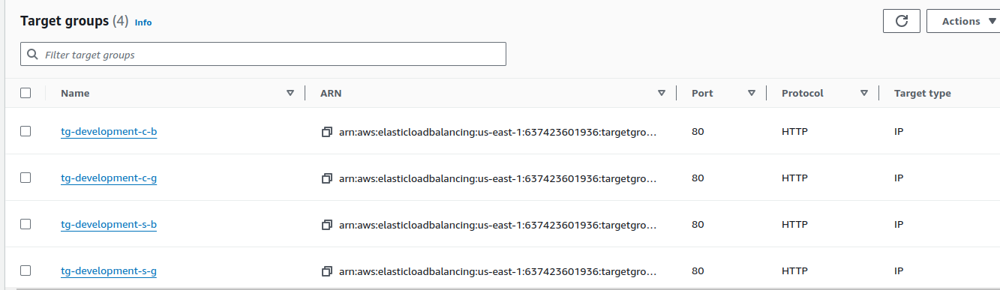


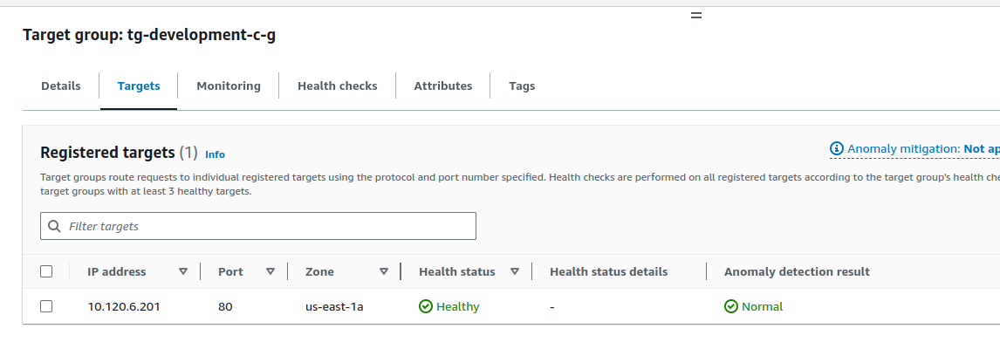

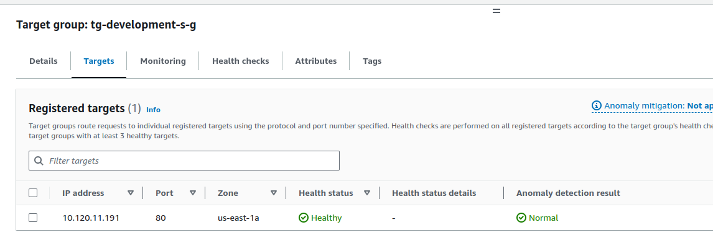


**AWS ECS**

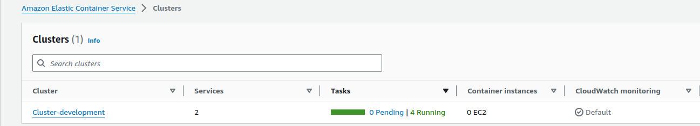


**CodePipeline**

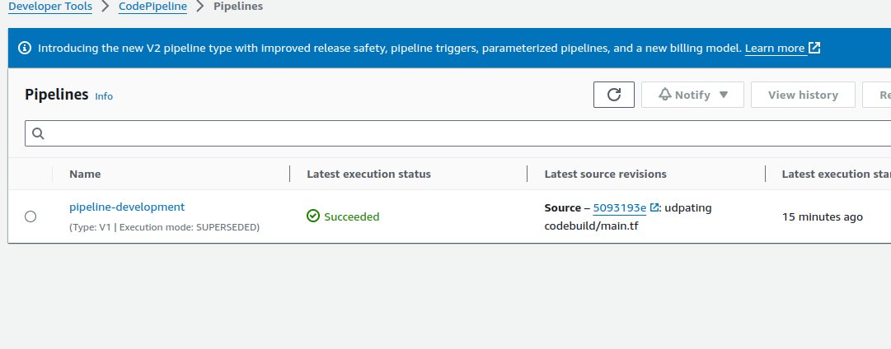


3. Now that the AWS resources are created successfully, it's time to launch the **RDS instance**. First, I'll allow my IP address to access the RDS instance so I can restore the database.


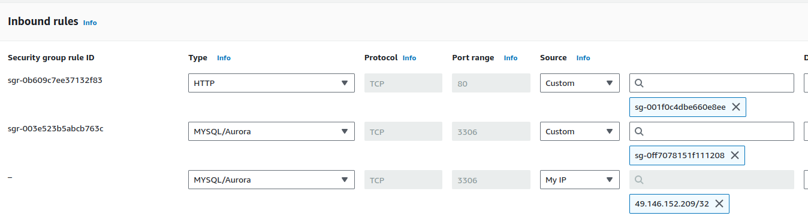


**Launch RDS**
- Allow Public Access Temporarily:

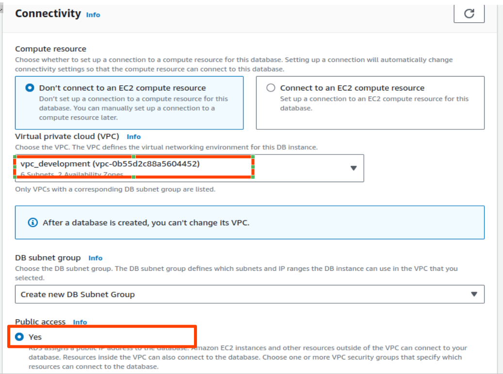

- Other Seetings: (Note if you choose autogenerated password, dont forget to save the password)
  
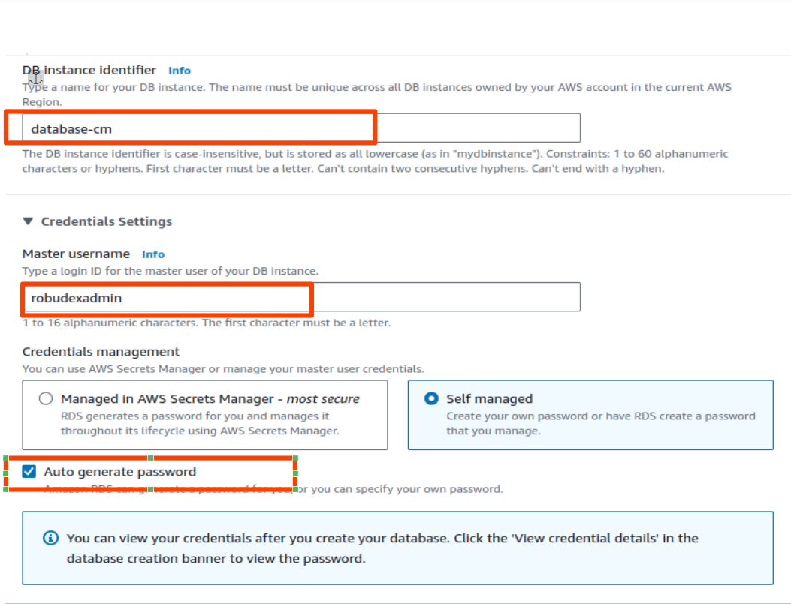


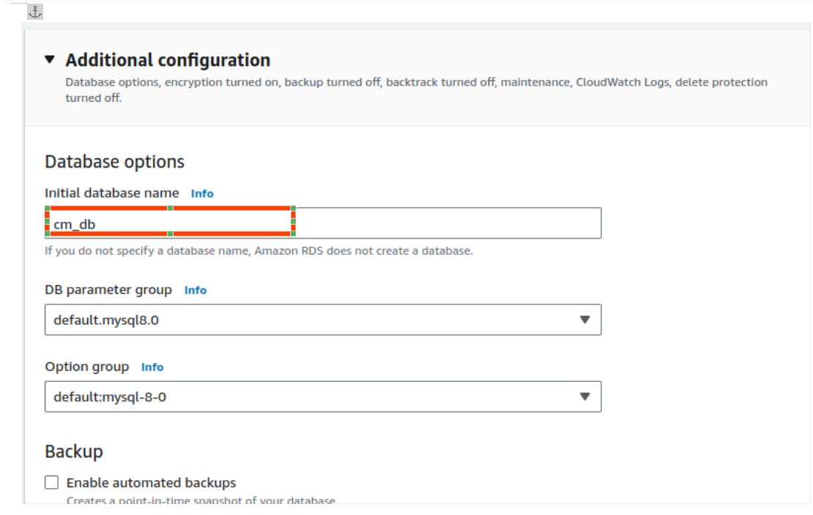

- Wait for the RDS instance to be created and for its status to become **'Available.'** Then, restore the db.sql file.


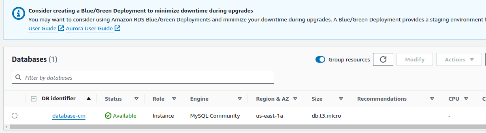

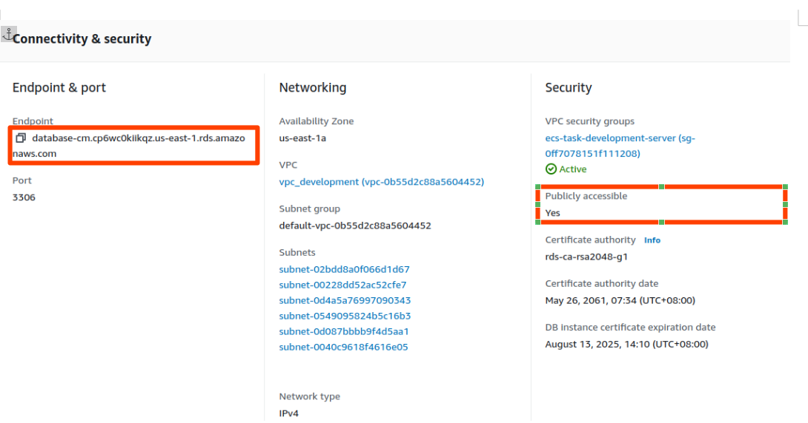


```bash
   mysql -u <YOUR_DB_USER> -h <YOUR-DB-ENDPOINT> --database <YOUR-DB-NAME> -p  < db.sql

```
- Verify if the database restoration was successful.

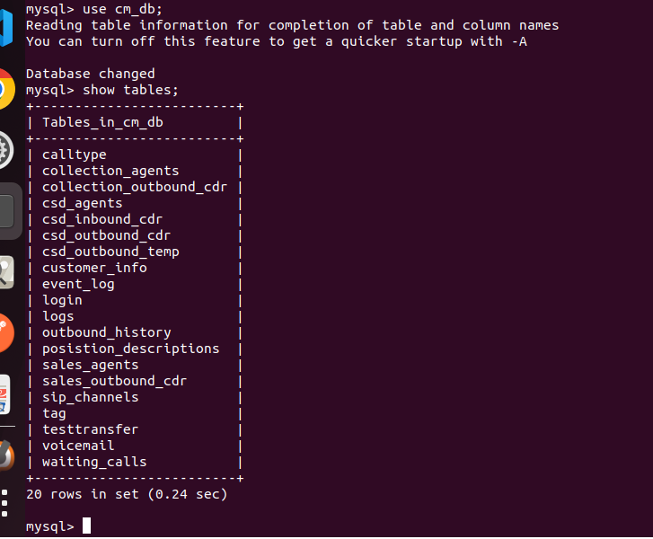

- Remove the security group rule that allows external access to MySQL.

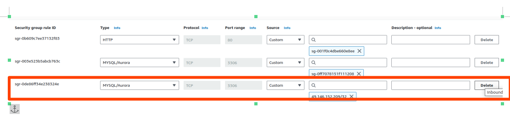

- Remove RDS public access

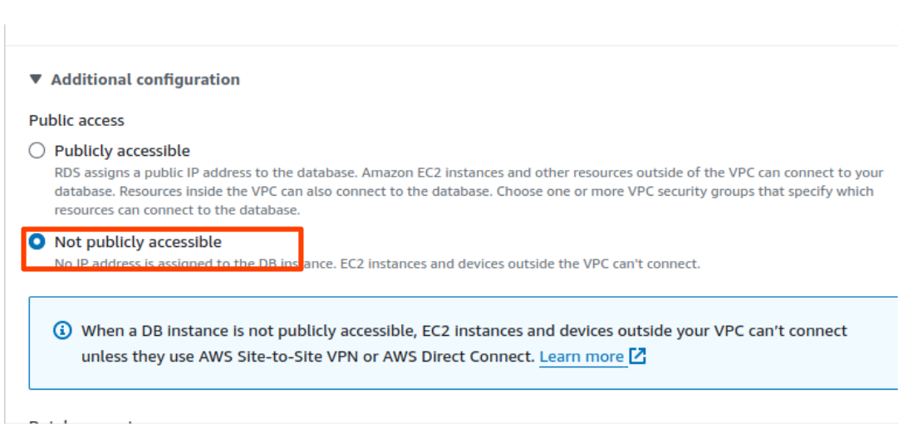


- "Update the **terraform.tfvars** file with the RDS configuration by setting the **db_host, db_user, db_name, and db_password** variables.


4. Once the **terraform.tfvars** file is updated with the new RDS values, run the Terraform commands again.

```bash
   cd /aws-ecs-fullstack-app-terraform/Infrastructure
   terraform init
   terraform validate 
   terraform fmt
   terraform plan
   terraform apply
```

5. Once Terraform is done, commit and push the changes to your GitHub to trigger the pipeline. Then, wait for the pipeline to complete.

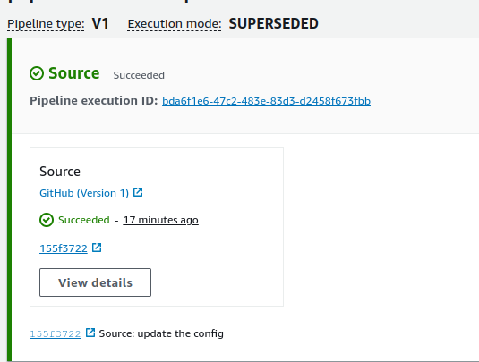

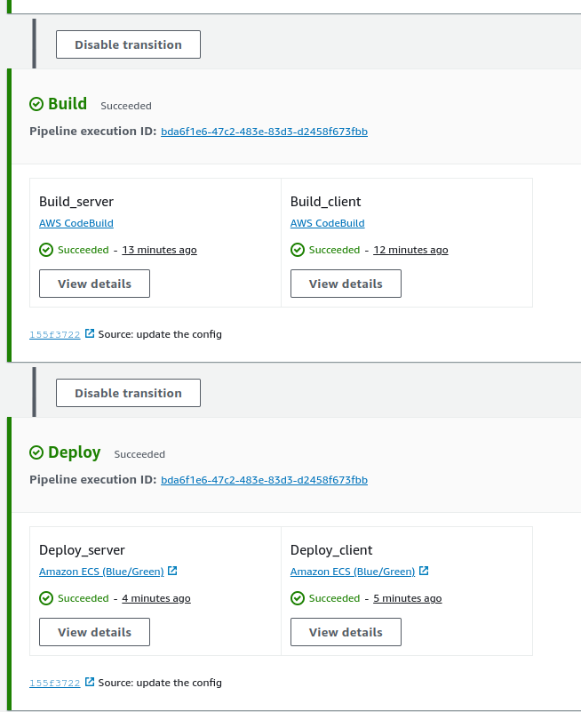

6. Test the app by copying the **Client ALB endpoint**, pasting it into the browser, appending **/cm_app/login** at the end, and pressing Enter.

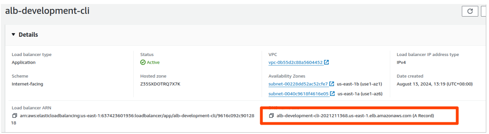


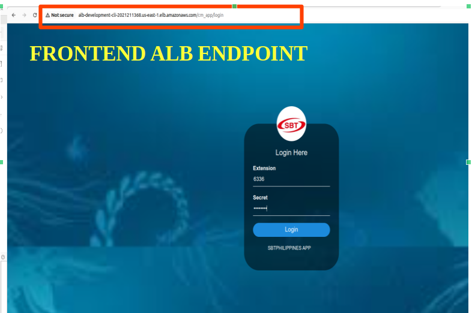


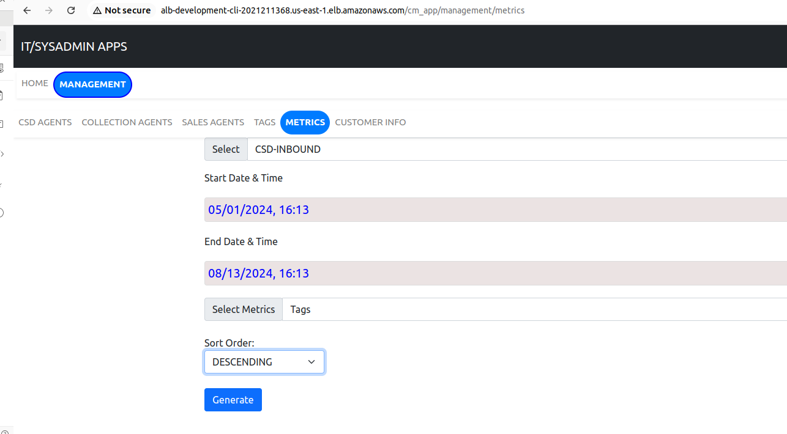


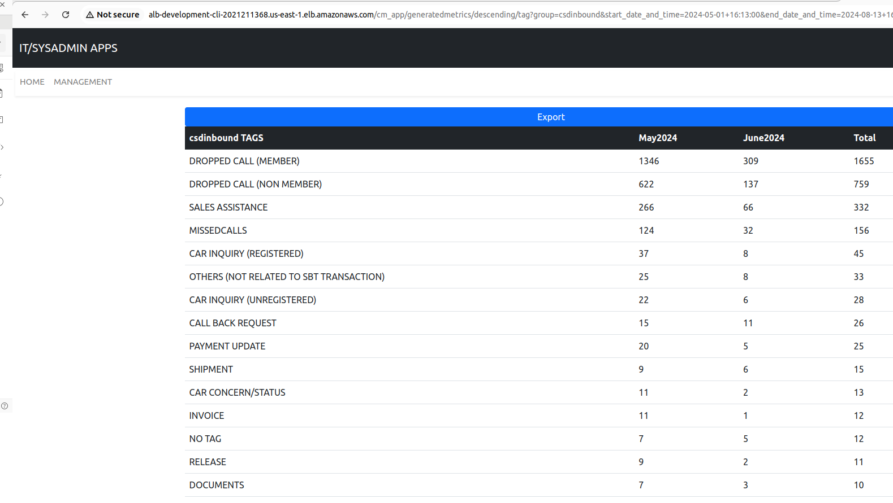


## Final Thoughts and Next Steps
This project marks a significant milestone in my DevOps journey, blending on-premise solutions with serverless architecture on AWS. The implementation of this CDR Monitoring App on AWS ECS Fargate allowed me to explore various AWS services, deepen my understanding of Terraform, and hone my skills in infrastructure automation.

## Future Enhancements
**Scalability**: Explore auto-scaling strategies for both ECS tasks and RDS instances to handle varying loads.
**Monitoring and Logging**: Implement comprehensive monitoring and logging using AWS CloudWatch, X-Ray, and other tools to gain deeper insights into application performance.
**Security Enhancements**: Introduce IAM roles with least privilege principles, enable VPC endpoints, and explore other AWS security best practices.

**Contribution and Learning**
The DevOps and cloud communities have been invaluable in my learning process. I plan to contribute back by sharing my experiences, writing blog posts, and possibly even creating my own sample repositories. Feedback and suggestions from the community are always welcome.


